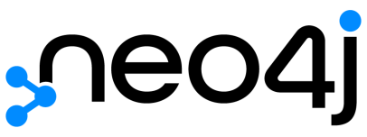

# Abstract

## What will you learn here?

In this katacoda you will gain your first experience with a graph database specifically Neo4j. You get to know the graph theory and what are the advantages of using graph databases. First you are going to import a csv-file into the graph database. In the next step you will determine how your graph model looks like. After that you will write some queries and learn how to gain information from a graph database using the query language Cypher. At the end you find some useful links to websites where you can learn more about Neo4j and Cypher.