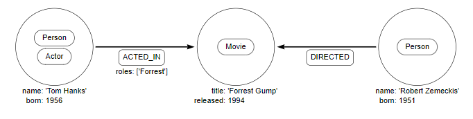
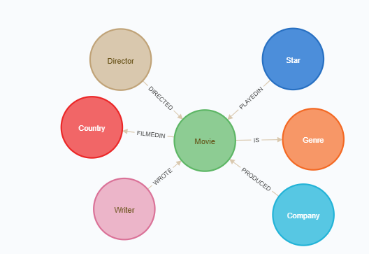

# What is a graph and why use graphs for databases?

A graph consists of nodes and relationships. A node can represent any type of an entity and can contain properties as key-value pairs. A relationship is the connection between a source node and a target node. It always has a direction and can store properties like a node. The following example graph has three nodes and two relationships and shows that Robert Zemeckis directed the movie "Forrest Gump" in which Tom Hanks played Forrest.

But why use graphs for databases? Graph models are easy to understand and are a powerful tool to determine how entities are connected with each other. In a specific use case, e.g. social network, graphs are a better option than relational databases to understand how a person is connected with other people in a social network.

# How does your graph model look like?

To see how your graph model looks like, first you have to connect to the Cypher shell. Cypher is the declarative graph query language for Neo4j. Cypher queries can be used for information gathering, updating and administration tasks. The Cypher shell allows you to send Cypher queries to the database which will then send you a response. To start the Cypher shell run following command:

`cypher-shell`{{execute}}

Now you are in the Cypher shell. To show how your database schema looks like enter the command `call db.schema();`{{execute}}. This command will display in terminal mode the nodes and relationships in a table, which might look cryptic. Because of that the following picture shows how it would look like if you entered the command in the the Neo4j Browser GUI. Nevertheless the table and the image contain the same information.

This graph shows 7 nodes and 6 relationships. In the middle of the graph is the movie which points where it was filmed and what kind of genre it is. Than there are three types of people, the director, the writer and the star, who are connected to movie. At last there is the company which produced the movie.

In the next step you will write your first query to get some information.