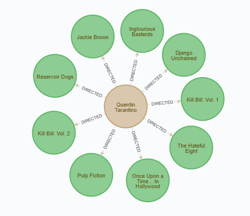

# Creating a simple query

The `MATCH` clause allows to specify a pattern to search for in the Neo4j database. A simple query with `MATCH` that you can now try is `MATCH (m:Movie) RETURN m.name, m.score, m.year LIMIT 1;`{{execute}}. When you execute this statement the shell will you return the name, score and the year of the first movie it could find. The `(m:Movie)` statement specifies that you search for a movie node. After `RETURN` you defined what properties you wanted to know and `LIMIT 1` tells Neo4j that you want only one entry.

# Creating a query with a relationship

Let us imagine that you want to look for all movies that were directed by Quentin Tarantino. The query for this is `MATCH (d:Director {director: "Quentin Tarantino"}) -[:DIRECTED]-> (m:Movie) RETURN d.director, m.name;`{{execute}}. Try it to view all movies from Quentin Tarantino. How does the `MATCH` clause work here. You can divide this statement in three parts that are `(d:Director {director: "Quentin Tarantino"})`, `-[:DIRECTED]->`, and `(m:Movie)`. In the first part you search for a director with the name Quentin Tarantino. The second part is the relationship `DIRECTED` which, you might noticed, looks like an arrow with a box in it. The last part is the destination node of `DIRECTED` which is a also a movie node. So this is the statement which looks for patterns where Quentin Tarantino directed a movie. And as you can see, after the `RETURN` clause you specified, that you want to print the director's name and the movie title. If you would type this query in the Neo4j browser and returning the nodes instead of the their properties you will get following graph visualized.

Feel free to try other queries and get comfortable with Cypher.